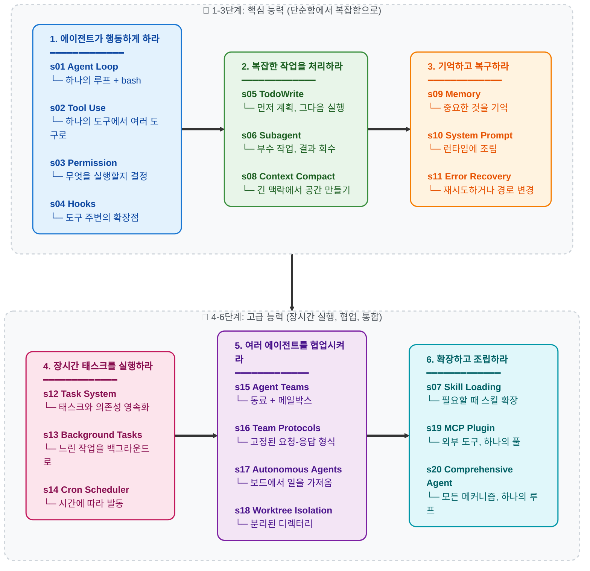

[English](./README.md) | [中文](./README-zh.md) | [日本語](./README-ja.md) | [한국어](./README-ko.md)

<a href="https://trendshift.io/repositories/19746" target="_blank"></a>

# Learn Claude Code -- 진짜 에이전트를 위한 하니스 엔지니어링

## 행위성(Agency)은 모델에서 나온다. 에이전트 제품 = 모델 + 하니스.

코드를 한 줄이라도 쓰기 전에, 한 가지를 분명히 해야 합니다.

**행위성 -- 인지하고, 추론하고, 행동하는 능력 -- 은 모델 학습에서 나오는 것이지 외부 코드의 오케스트레이션에서 나오는 것이 아닙니다.** 하지만 동작하는 에이전트 제품에는 모델과 하니스가 모두 필요합니다. 모델은 운전자이고, 하니스는 차량입니다. 이 저장소는 그 차량을 만드는 법을 가르칩니다.

### 행위성은 어디에서 오는가

모든 에이전트의 핵심에는 신경망 -- Transformer, RNN, 학습된 함수 -- 이 있으며, 이는 인지·추론·행동의 시퀀스 위에서 수십억 번의 그래디언트 업데이트로 빚어집니다. 행위성은 결코 주변 코드가 부여한 것이 아닙니다. 그것은 학습 과정에서 배워진 것입니다.

인간이 그 원초적 증거입니다. 수백만 년의 진화적 압력으로 정련된 생물학적 신경망은 감각을 통해 세상을 인지하고, 뇌를 통해 추론하며, 신체를 통해 행동합니다. DeepMind, OpenAI, Anthropic이 "에이전트"라고 말할 때, 그들이 의미하는 핵심은 모두 동일합니다: **학습을 통해 행동하는 법을 배운 모델, 그리고 그 모델이 특정 환경에서 작동하도록 해주는 인프라.**

역사적 기록은 명백합니다:

- **2013 -- DeepMind DQN, Atari를 플레이하다.** 원시 픽셀과 게임 점수만을 입력받은 하나의 신경망이 7개의 Atari 2600 게임을 학습했고, 기존 알고리즘을 능가했으며 그중 3개에서 인간 전문가를 이겼습니다. 2015년에는 [49개 게임에서 프로 테스터 수준](https://www.nature.com/articles/nature14236)으로 확장되어 *Nature*에 게재되었습니다. 게임별 규칙은 없었습니다. 하나의 모델이 경험으로부터 배웠을 뿐입니다.

- **2019 -- OpenAI Five, Dota 2를 정복하다.** 다섯 개의 신경망이 10개월에 걸쳐 [45,000년 분량의 Dota 2를 자기 자신과 대전](https://openai.com/index/openai-five-defeats-dota-2-world-champions/)한 뒤, TI8 세계 챔피언 **OG**를 라이브 경기에서 2-0으로 꺾었습니다. 공개 경기장에서 AI는 42,729경기 중 99.4%를 승리했습니다. 스크립트로 짜인 전략은 없었습니다. 모델은 자기 대전(self-play)을 통해 팀워크를 배웠습니다.

- **2019 -- DeepMind AlphaStar, StarCraft II를 정복하다.** AlphaStar는 비공개 경기에서 [프로 선수를 10-1로 이겼고](https://deepmind.google/blog/alphastar-mastering-the-real-time-strategy-game-starcraft-ii/), 이후 유럽 서버에서 [그랜드마스터 등급](https://www.nature.com/articles/d41586-019-03298-6)에 도달 -- 90,000명 중 상위 0.15% -- 했습니다. 체스나 바둑을 훨씬 능가하는 조합적 행동 공간을 가진, 불완전 정보의 실시간 게임에서 이룬 성과입니다.

- **2019 -- Tencent Jueyu, 왕자영요(Honor of Kings)를 지배하다.** Tencent AI Lab의 "Jueyu" 시스템은 World Champion Cup 준결승의 [완전한 5대5 경기에서 KPL 프로 선수들을 꺾었습니다](https://www.jiemian.com/article/3371171.html). 1대1 모드에서 프로들은 [15경기 중 단 1경기만 이겼고, 가장 길었던 경기조차 8분 미만](https://developer.aliyun.com/article/851058)이었습니다. 학습 강도: 하루가 인간 440년에 해당했습니다. 자기 대전을 통해 게임 전체를 맨바닥에서 배운 모델입니다.

- **2024-2025 -- LLM 에이전트, 소프트웨어 엔지니어링을 재편하다.** Claude, GPT, Gemini -- 인간의 코드와 추론의 전 영역으로 학습된 대규모 언어 모델 -- 이 코딩 에이전트로 배치되고 있습니다. 이들은 코드베이스를 읽고, 구현을 작성하고, 실패를 디버깅하며, 팀으로 협업합니다. 아키텍처는 이전의 모든 에이전트와 동일합니다: 학습된 모델을 환경에 배치하고, 인지와 행동을 위한 도구를 부여하는 것.

모든 이정표가 같은 사실을 가리킵니다: **행위성 -- 인지하고, 추론하고, 행동하는 능력 -- 은 학습되는 것이지 코딩되는 것이 아니다.** 하지만 모든 에이전트는 작동할 환경도 필요로 합니다: Atari 에뮬레이터, Dota 2 클라이언트, StarCraft II 엔진, IDE와 터미널. 모델은 지능을 제공하고, 환경은 행동 공간을 제공합니다. 둘이 함께 완전한 에이전트를 이룹니다.

### 에이전트가 아닌 것

"에이전트"라는 단어는 프롬프트 배관(plumbing) 산업 전체에 의해 납치되었습니다.

드래그 앤 드롭 워크플로 빌더. 노코드 "AI Agent" 플랫폼. 프롬프트 체인 오케스트레이션 라이브러리. 이들은 하나의 망상을 공유합니다: LLM API 호출을 if-else 분기, 노드 그래프, 하드코딩된 라우팅 로직으로 엮으면 "에이전트를 만드는 것"이 된다는 망상.

그렇지 않습니다. 그들이 만들어내는 것은 루브 골드버그 장치 -- 과도하게 엔지니어링되고, 깨지기 쉬우며, LLM이 영광스러운 텍스트 완성 노드로 끼워 넣어진 절차적 규칙 파이프라인 -- 입니다. 그것은 에이전트가 아닙니다. 그것은 거창한 허세를 부리는 셸 스크립트입니다.

절차적 로직을 쌓아 올린다고 -- 방대한 규칙 트리, 노드 그래프, 연쇄된 프롬프트 폭포 -- 충분한 접착 코드가 자율적 행동을 저절로 만들어내길 기도한다고 해서 지능을 무차별 대입으로 만들어낼 수는 없습니다. 그렇게 되지 않습니다. 행위성을 엔지니어링으로 존재하게 만들 수는 없습니다. 행위성은 학습되는 것이지 코딩되는 것이 아닙니다.

### 사고의 전환: "에이전트 만들기"에서 하니스 만들기로

누군가 "나는 에이전트를 만들고 있다"고 말할 때, 그것은 둘 중 하나만을 의미할 수 있습니다:

**1. 모델을 학습시키는 것.** 강화 학습, 파인튜닝, RLHF, 또는 다른 그래디언트 기반 방법으로 가중치를 조정하는 것. 궤적(trajectory) 데이터 -- 목표 도메인에서의 인지·추론·행동의 실제 시퀀스 -- 를 수집해 모델의 행동을 빚는 것. 이것은 DeepMind, OpenAI, Tencent AI Lab, Anthropic이 하는 일입니다.

**2. 하니스를 만드는 것.** 모델에게 작동 환경을 제공하는 코드를 작성하는 것. 이것은 우리 대부분이 하는 일이며, 이 저장소의 핵심입니다.

하니스는 에이전트가 특정 도메인에서 일하는 데 필요한 모든 것입니다:

```
하니스 = 도구 + 지식 + 관찰 + 행동 인터페이스 + 권한

    도구(Tools):          파일 I/O, 셸, 네트워크, 데이터베이스, 브라우저
    지식(Knowledge):      제품 문서, 도메인 레퍼런스, API 명세, 스타일 가이드
    관찰(Observation):    git diff, 에러 로그, 브라우저 상태, 센서 데이터
    행동(Action):         CLI 명령, API 호출, UI 상호작용
    권한(Permissions):    샌드박스 격리, 승인 워크플로, 신뢰 경계
```

모델은 결정하고, 하니스는 실행합니다. 모델은 추론하고, 하니스는 맥락을 제공합니다. 모델은 운전자이고, 하니스는 차량입니다.

이 저장소는 그 차량을 만드는 법을 가르칩니다. 코딩을 위한 차량입니다. 하지만 그 설계 패턴은 어떤 도메인에도 일반화됩니다.

### 하니스 엔지니어가 실제로 하는 일

이 저장소를 읽고 있다면, 당신은 십중팔구 하니스 엔지니어입니다. 그 일이 실제로 무엇을 수반하는지는 다음과 같습니다:

- **도구를 구현한다.** 에이전트에게 손을 준다. 파일 읽기/쓰기, 셸 실행, API 호출, 브라우저 제어, 데이터베이스 쿼리. 각 도구는 에이전트가 환경에서 취할 수 있는 하나의 행동입니다. 원자적이고, 조합 가능하며, 명확하게 기술되도록 설계하세요.

- **지식을 큐레이션한다.** 에이전트에게 도메인 전문성을 준다. 제품 문서, 아키텍처 결정 기록, 스타일 가이드, 컴플라이언스 요구사항. 미리가 아니라 필요할 때(on demand) 로드하세요.

- **맥락을 관리한다.** 에이전트에게 깨끗한 기억을 준다. 서브에이전트 격리는 노이즈 누출을 막습니다. 맥락 압축은 과거 기록이 현재를 압도하는 것을 막습니다. 태스크 시스템은 목표가 단일 대화를 넘어 지속되게 합니다.

- **권한을 통제한다.** 에이전트에게 경계를 준다. 파일 접근을 샌드박싱하세요. 파괴적 작업에는 승인을 요구하세요. 에이전트와 외부 시스템 사이의 신뢰 경계를 강제하세요.

- **궤적 데이터를 수집한다.** 에이전트가 당신의 하니스에서 실행하는 모든 행동 시퀀스는 학습 신호입니다. 실제 배포 궤적은 차세대 에이전트 모델을 파인튜닝하기 위한 원재료입니다.

당신은 지능을 작성하는 것이 아닙니다. 당신은 지능이 거주하는 세계를 만드는 것입니다. 그 세계의 품질이 지능이 자신을 얼마나 효과적으로 표현할 수 있는지를 직접 결정합니다.

**하니스를 잘 만드세요. 나머지는 모델이 합니다.**

### 왜 Claude Code인가

우리가 본 것 중 가장 우아하고 가장 완전한 에이전트 하니스 구현이기 때문입니다. 어떤 영리한 트릭 때문이 아니라, 그것이 *하지 않는* 것 때문입니다: 그것은 에이전트가 되려 하지 않습니다. 경직된 워크플로를 강요하지 않습니다. 모델 자신의 판단을 손으로 짠 의사결정 트리로 대체하지 않습니다. 모델에게 도구, 지식, 맥락 관리, 권한 경계를 준 다음 -- 비켜섭니다.

Claude Code를 그 본질까지 벗겨내면:

```
Claude Code = 하나의 에이전트 루프
            + 도구 (bash, read, write, edit, glob, grep, browser...)
            + 온디맨드 스킬 로딩
            + 맥락 압축
            + 서브에이전트 생성
            + 의존성 그래프를 가진 태스크 시스템
            + 비동기 메일박스 팀 협업
            + worktree로 격리된 병렬 실행
            + 권한 거버넌스
            + 훅(hooks) 확장 시스템
            + 메모리 영속성
            + MCP 외부 능력 라우팅
```

그게 전부입니다. 에이전트 자체는? Claude입니다. 하나의 모델. Anthropic이 인간 추론과 코드의 전 영역으로 학습시킨 것. 하니스가 Claude를 똑똑하게 만든 것이 아닙니다. Claude는 이미 똑똑했습니다. 하니스는 Claude에게 손과 눈, 그리고 작업 공간을 주었을 뿐입니다.

핵심 교훈은 "Claude Code를 복사하라"가 아닙니다. 핵심 교훈은 이것입니다: **최고의 에이전트 제품은 자신의 일이 지능이 아니라 하니스임을 이해하는 엔지니어에게서 나온다.**

---

```
                    에이전트 패턴
                    =============

    사용자 --> messages[] --> LLM --> 응답
                                       |
                            stop_reason == "tool_use"?
                           /                          \
                         예                           아니오
                          |                             |
                    도구 실행                       텍스트 반환
                    결과 추가
                    루프 복귀 -----------------> messages[]


    모델은 언제 도구를 호출하고 언제 멈출지 결정한다.
    코드는 모델이 요청한 것을 실행할 뿐이다.
    이 저장소는 이 루프 주변의 모든 것을 만드는 법을 가르친다 --
    특정 도메인에서 에이전트를 효과적으로 만드는 하니스 말이다.
```

## 핵심 패턴

```python
def agent_loop(messages):
    while True:
        response = client.messages.create(
            model=MODEL, system=SYSTEM,
            messages=messages, tools=TOOLS,
        )
        messages.append({"role": "assistant",
                         "content": response.content})

        if response.stop_reason != "tool_use":
            return

        results = []
        for block in response.content:
            if block.type == "tool_use":
                output = TOOL_HANDLERS[block.name](**block.input)
                results.append({
                    "type": "tool_result",
                    "tool_use_id": block.id,
                    "content": output,
                })
        messages.append({"role": "user", "content": results})
```

모든 강의는 이 루프 위에 하나의 하니스 메커니즘을 얹습니다 -- 루프 자체는 결코 바뀌지 않습니다. 루프는 에이전트의 것이고, 메커니즘은 하니스의 것입니다.

루프는 불변입니다. 도구, 지식, 권한은 바뀝니다. 에이전트 = 모델(LLM) + 일반화된 작동 환경(하니스).

---

## 버전 상태

이 저장소는 현재 두 개의 튜토리얼 트랙을 담고 있습니다:

- **현재 트랙: 루트 레벨 `s01-s20`**
  루트 레벨의 `s01_*` ... `s20_*` 폴더가 새로운 정식(canonical) 버전입니다. 각 챕터에는 완전한 서사형 README, 번역본, 실행 가능한 `code.py`, 그리고 필요한 경우 다이어그램이 포함됩니다.
- **레거시 전환 트랙: `docs/`, `agents/`, 그리고 현재 `web/` 앱**
  이들은 여전히 이전의 12강 버전을 보존하고 있습니다. 새로운 20강 트랙이 자리 잡는 동안 기존 독자, 오래된 링크, 웹 플랫폼을 위해 임시로 유지됩니다.

지금 시작한다면, 루트 레벨의 `s01_agent_loop/`부터 `s20_comprehensive/`까지의 챕터를 읽으세요. 오래된 링크를 따라왔거나 현재 웹 앱을 사용 중이라면, 아마 레거시 12강 트랙을 보고 있을 것입니다. 레거시와 현재의 챕터 번호는 항상 일치하지는 않으므로, 트랙 간에 챕터 번호를 섞지 마세요.

### 레거시-현재 매핑

| 레거시 12강 트랙 | 현재 20강 트랙 | 주제 |
|---|---|---|
| old s01 | new s01 | Agent Loop |
| old s02 | new s02 | Tool Use |
| old s03 | new s05 | TodoWrite |
| old s04 | new s06 | Subagent |
| old s05 | new s07 | Skill Loading |
| old s06 | new s08 | Context Compact |
| old s07 | new s12 | Task System |
| old s08 | new s13 | Background Tasks |
| old s09 | new s15 | Agent Teams |
| old s10 | new s16 | Team Protocols |
| old s11 | new s17 | Autonomous Agents |
| old s12 | new s18 | Worktree Isolation |
| new only | s03, s04, s09, s10, s11, s14, s19, s20 | Permission, Hooks, Memory, System Prompt, Error Recovery, Cron, MCP, Comprehensive Agent |

---

## 범위(Scope)

이 저장소는 0에서 1까지의 하니스 엔지니어링 학습 프로젝트입니다: 에이전트 모델 주변의 작동 환경을 만드는 법을 가르칩니다. 학습 경로를 명확하게 유지하기 위해, 일부 프로덕션 메커니즘은 의도적으로 단순화하거나 생략했습니다:

- `PreToolUse`, `SessionStart/End`, `ConfigChange` 같은 완전한 이벤트/훅 버스 동작.
  교육용 코드는 필요한 곳에 최소한의 라이프사이클 이벤트만 사용합니다.
- 규칙 기반 권한 거버넌스와 완전한 신뢰 워크플로.
- resume/fork 같은 세션 라이프사이클 제어, 그리고 더 완전한 worktree 라이프사이클 처리.
- 전송(transport), OAuth, 리소스 구독, 폴링 같은 완전한 MCP 런타임 세부사항.

이 저장소의 JSONL 메일박스 프로토콜은 교육용 구현이며, 특정 프로덕션 내부 구현에 대한 주장이 아닙니다.

---

## 20개의 점진적 강의

**각 강의는 하나의 하니스 메커니즘을 추가합니다. 각 메커니즘에는 좌우명이 있습니다.**

> **s01** &nbsp; *"하나의 루프와 Bash면 충분하다"* &mdash; 하나의 도구 + 하나의 루프 = 하나의 에이전트
>
> **s02** &nbsp; *"도구를 추가한다는 것은 핸들러 하나를 추가하는 것"* &mdash; 루프는 그대로, 새 도구는 디스패치 맵에 등록된다
>
> **s03** &nbsp; *"먼저 경계를 정하고, 그다음 자유를 부여하라"* &mdash; 무엇을 실행할 수 있고, 무엇을 멈춰야 하며, 무엇이 승인을 필요로 하는지 검사한다
>
> **s04** &nbsp; *"루프를 다시 쓰지 말고, 루프 주위에 훅을 걸어라"* &mdash; 메인 루프를 바꾸지 않고 확장점을 추가한다
>
> **s05** &nbsp; *"계획 없는 에이전트는 표류한다"* &mdash; 시작 전에 단계를 나열하라; 완수율이 두 배가 된다
>
> **s06** &nbsp; *"큰 작업은 작게 쪼개고, 각 하위 작업은 깨끗한 맥락을 받는다"* &mdash; 서브에이전트가 부수 작업을 하고 결과만 가져온다
>
> **s07** &nbsp; *"지식은 미리가 아니라 필요할 때 로드하라"* &mdash; 먼저 스킬을 나열하고, 필요할 때만 펼친다
>
> **s08** &nbsp; *"맥락은 언제나 가득 찬다 -- 공간을 만들 방법을 가져라"* &mdash; 다층 압축 전략이 무한한 세션을 사준다
>
> **s09** &nbsp; *"중요한 것은 기억하고, 중요하지 않은 것은 잊어라"* &mdash; 세 가지 하위 시스템: 선택, 추출, 통합
>
> **s10** &nbsp; *"프롬프트는 하드코딩이 아니라 런타임에 조립된다"* &mdash; 섹션 기반 연결, 필요할 때 로드
>
> **s11** &nbsp; *"에러는 끝이 아니라 재시도의 시작이다"* &mdash; 실패하면 재시도하거나, 공간을 만들거나, 다른 경로를 택한다
>
> **s12** &nbsp; *"큰 목표는 작은 태스크로 쪼개고, 순서를 매겨, 디스크에 영속화한다"* &mdash; 멀티 에이전트 협업의 기반을 닦는 파일 기반 태스크 그래프
>
> **s13** &nbsp; *"느린 작업은 백그라운드로, 에이전트는 계속 생각한다"* &mdash; 백그라운드 스레드가 명령을 실행하고, 완료 시 알림이 주입된다
>
> **s14** &nbsp; *"사람의 트리거 없이 스케줄에 맞춰 실행한다"* &mdash; 시간에 따라 자동으로 태스크를 발동한다
>
> **s15** &nbsp; *"한 에이전트에게 너무 크다 -- 동료에게 위임하라"* &mdash; 영속적인 동료 + 비동기 메일박스
>
> **s16** &nbsp; *"동료에게는 공유된 통신 규칙이 필요하다"* &mdash; 협업을 위해 고정된 요청-응답 형식을 사용한다
>
> **s17** &nbsp; *"동료는 보드를 확인하고, 스스로 일을 가져간다"* &mdash; 하나씩 배정하는 리더가 없는 자기 조직화
>
> **s18** &nbsp; *"각자 자기 디렉터리에서 작업한다, 간섭 없이"* &mdash; 태스크는 목표를, worktree는 디렉터리를 소유하고, ID로 묶인다
>
> **s19** &nbsp; *"능력이 부족한가? MCP로 더 꽂아 넣어라"* &mdash; 외부 도구를 동일한 도구 풀에 연결한다
>
> **s20** &nbsp; *"여러 메커니즘, 하나의 루프"* &mdash; 앞선 모든 메커니즘이 하나의 완전한 하니스로 돌아온다

---

## 학습 경로

큰 흐름: 행동하기 → 복잡한 작업 처리 → 기억하고 복구하기 → 장시간 태스크 실행 → 협업 → 확장하고 조립하기.



---

## 전체 챕터

| 챕터 | 주제 | 핵심 개념 |
|---|---|---|
| [s01](./s01_agent_loop/) | Agent Loop | `messages` / `while True` / `stop_reason` |
| [s02](./s02_tool_use/) | Tool Use | `TOOL_HANDLERS` / 디스패치 맵 / 동시성 |
| [s03](./s03_permission/) | Permission System | `PermissionRule` / 승인 파이프라인 |
| [s04](./s04_hooks/) | Hook System | `PreToolUse` / `PostToolUse` / 확장점 |
| [s05](./s05_todo_write/) | TodoWrite | `TodoItem` / 계획 후 실행 |
| [s06](./s06_subagent/) | Subagent | `fresh messages[]` / 맥락 격리 |
| [s07](./s07_skill_loading/) | Skill Loading | `SkillManifest` / 온디맨드 주입 |
| [s08](./s08_context_compact/) | Context Compact | snipCompact / microCompact / toolResultBudget / autoCompact |
| [s09](./s09_memory/) | Memory System | 선택 / 추출 / 통합 |
| [s10](./s10_system_prompt/) | System Prompt | 런타임 조립 / 섹션 연결 |
| [s11](./s11_error_recovery/) | Error Recovery | 토큰 에스컬레이션 / 폴백 모델 / 재시도 전략 |
| [s12](./s12_task_system/) | Task System | `TaskRecord` / `blockedBy` / 디스크 영속화 |
| [s13](./s13_background_tasks/) | Background Tasks | 스레드 실행 / 알림 큐 |
| [s14](./s14_cron_scheduler/) | Cron Scheduler | 영속적 스케줄링 / 세션 범위 트리거 |
| [s15](./s15_agent_teams/) | Agent Teams | `MessageBus` / 인박스 / 권한 버블링 |
| [s16](./s16_team_protocols/) | Team Protocols | 종료 핸드셰이크 / 계획 승인 |
| [s17](./s17_autonomous_agents/) | Autonomous Agents | 유휴 사이클 / 자동 클레임 / 자기 조직화 |
| [s18](./s18_worktree_isolation/) | Worktree Isolation | `WorktreeRecord` / 태스크-디렉터리 바인딩 |
| [s19](./s19_mcp_plugin/) | MCP Plugin | 멀티 전송 / 채널 라우팅 / 도구 풀 조립 |
| [s20](./s20_comprehensive/) | Comprehensive Agent | 하나의 루프 주변의 모든 메커니즘 |

---

## 읽는 방법

각 챕터는 하나의 폴더입니다. 하나를 열면 다음을 보게 됩니다:

```
s08_context_compact/
  README.md              # 인라인 코드를 포함한 완전한 서사
  README.en.md           # 영어 번역
  README.ja.md           # 일본어 번역
  code.py                # 독립 실행 가능한 구현
  images/                # SVG 다이어그램 (필요한 경우)
```

핵심 아이디어를 위해 `README.md`를 읽고 코드를 따라가세요. 복잡한 챕터에는 깊이 파고들기 위한 `<details>` 접힘이 있습니다 -- 더 깊이 들어가고 싶을 때 펼치세요. 단순한 챕터에는 0-1개의 다이어그램이, 복잡한 챕터에는 더 많은 다이어그램이 있습니다.

s01부터 s20까지 순서대로 읽으세요. 각 챕터는 이전 챕터를 읽었다고 가정하며, 다음 챕터로 이어지는 갈고리로 끝납니다.

---

## 빠른 시작

### 현재 20강 트랙

```sh
git clone https://github.com/shareAI-lab/learn-claude-code
cd learn-claude-code
pip install -r requirements.txt
cp .env.example .env   # ANTHROPIC_API_KEY 설정

python s01_agent_loop/code.py        # 여기서 시작 -- 하나의 루프 + bash
python s08_context_compact/code.py   # 맥락 압축 (복잡)
python s20_comprehensive/code.py     # 종착점: 하나의 루프 안의 모든 메커니즘
```

### 레거시 12강 트랙

```sh
python agents/s01_agent_loop.py
python agents/s12_worktree_task_isolation.py
python agents/s_full.py
```

### 웹 플랫폼

현재 웹 앱은 여전히 레거시 `docs/` s01-s12 트랙을 렌더링합니다. 새로운 s01-s20 트랙은 루트 레벨 폴더를 사용하세요.

```sh
cd web && npm install && npm run dev   # http://localhost:3000
```

---

## 프로젝트 구조

```
learn-claude-code/
  s01_agent_loop/          # 챕터당 폴더 하나
    README.md              #   중국어 원본 (완전한 서사)
    README.en.md           #   영어 번역
    README.ja.md           #   일본어 번역
    code.py                #   독립 실행 가능한 코드
    images/                #   SVG 다이어그램
  s02_tool_use/
  ...
  s19_mcp_plugin/
  s20_comprehensive/       # 종착점 챕터
  agents/                  # 레거시 12개 실행본 + s_full.py
  skills/                  # s07에서 사용하는 스킬 파일
  docs/                    # 레거시 12강 문서, 전환 기간 동안 유지
  web/                     # 현재 레거시 docs/ 트랙을 렌더링
  tests/
```

---

## 다음은 무엇인가

20개의 강의를 마치면, 당신은 하니스 엔지니어링을 안에서 밖까지 이해하게 됩니다. 그 지식을 제품으로 바꾸는 두 가지 경로가 있습니다:

### Kode Agent CLI -- 오픈소스 코딩 에이전트 CLI

> `npm i -g @shareai-lab/kode`

스킬과 LSP 지원, Windows 호환, GLM / MiniMax / DeepSeek 및 기타 오픈 모델과 동작. 설치하고 바로 시작하세요.

GitHub: **[shareAI-lab/Kode-Agent](https://github.com/shareAI-lab/Kode-Agent)**

### Kode Agent SDK -- 에이전트 능력을 당신의 애플리케이션에 임베드

사용자별 프로세스 오버헤드가 없는 독립 라이브러리. 백엔드, 브라우저 확장, 임베디드 디바이스, 또는 어떤 런타임에도 임베드하세요.

GitHub: **[shareAI-lab/kode-agent-sdk](https://github.com/shareAI-lab/kode-agent-sdk)**

---

## 자매 튜토리얼: 수동적 세션에서 상시 가동 어시스턴트로

이 저장소에서 가르치는 하니스는 **쓰고 버리는(use-and-discard)** 종류입니다 -- 터미널을 열고, 에이전트에게 태스크를 주고, 끝나면 닫고, 다음 세션은 새로 시작합니다. Claude Code는 이렇게 동작합니다.

하지만 [OpenClaw](https://github.com/openclaw/openclaw)는 또 다른 가능성을 증명합니다: 동일한 에이전트 코어 위에, 두 가지 추가 하니스 메커니즘이 에이전트를 "찔러야 움직이는" 것에서 "30초마다 스스로 깨어나 일을 찾는" 것으로 바꿉니다:

- **하트비트(Heartbeat)** -- 30초마다 하니스가 에이전트에게 메시지를 보내, 대기 중인 작업을 확인하게 합니다. 할 일이 없으면? 계속 잠듭니다. 무언가 나타나면? 즉시 행동합니다.
- **크론(Cron)** -- 에이전트가 자신의 미래 태스크를 스케줄할 수 있고, 시간이 되면 자동으로 발동됩니다.

여기에 IM 멀티 채널 라우팅(WhatsApp / Telegram / Slack / Discord 및 13개 이상의 플랫폼), 영속적 맥락 메모리, 그리고 Soul 성격 시스템을 더하면, 에이전트는 일회용 도구에서 상시 가동되는 개인 AI 어시스턴트로 변신합니다.

**[claw0](https://github.com/shareAI-lab/claw0)**는 이러한 하니스 메커니즘을 맨바닥에서부터 분해하는 우리의 자매 교육 저장소입니다:

```
claw agent = 에이전트 코어 + 하트비트 + 크론 + IM 채팅 + 메모리 + 소울(soul)
```

```
learn-claude-code                   claw0
(에이전트 하니스 내부:                (상시 가동 하니스:
 루프, 도구, 계획,                    하트비트, 크론, IM 채널,
 팀, worktree 격리)                   메모리, Soul 성격)
```

## 라이선스

MIT

---

**행위성은 모델에서 나온다. 하니스는 그 행위성이 착지할 장소를 준다. 하니스를 잘 만들면, 나머지는 모델이 한다.**

**Bash면 충분하다. 진짜 에이전트야말로 우주가 필요로 하는 전부다.**

**이것은 "소스 코드를 복사하라"가 아니다. 이것은 "핵심 설계를 파악하고 직접 만들어보라"다.**
